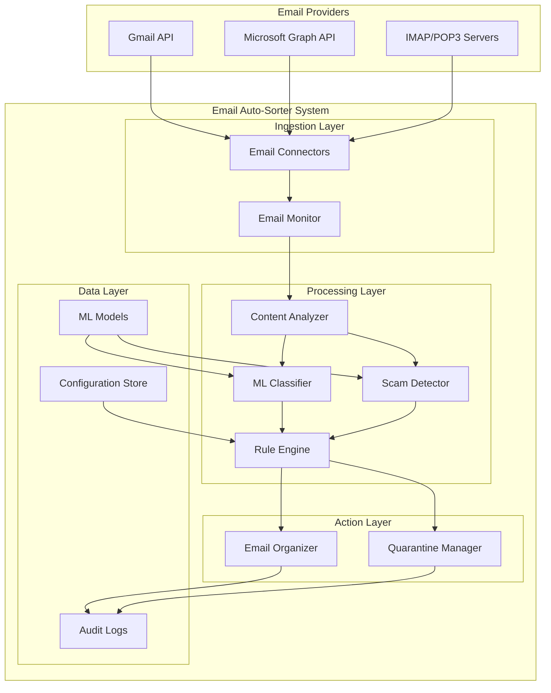

# Design Document: Smart Email Auto-Sorter + Scam Blocker

## Overview

The Smart Email Auto-Sorter + Scam Blocker is a multi-layered email management system implemented in C++ that combines machine learning-based classification, rule-based filtering, and security threat detection. The system operates as a high-performance background service that integrates with multiple email providers through their respective APIs and standard protocols.

The architecture follows a modular design with clear separation of concerns: email ingestion, content analysis, classification, security scanning, and action execution. This allows for independent scaling, testing, and maintenance of each component while ensuring reliable email processing across different email providers. The C++ implementation provides optimal performance for real-time email processing and efficient memory usage for handling large email volumes.

## Architecture

### High-Level Architecture



### Component Architecture

The system is built using a microservices-inspired architecture with the following core components:

1. **Email Connectors**: Provider-specific adapters for Gmail API, Microsoft Graph, and IMAP/POP3
2. **Email Monitor**: Centralized email ingestion and event processing
3. **Content Analyzer**: Email parsing, feature extraction, and metadata analysis
4. **ML Classifier**: Machine learning-based email categorization
5. **Scam Detector**: Security threat identification and risk assessment
6. **Rule Engine**: Business logic processor for sorting and filtering rules
7. **Email Organizer**: Email movement and folder management
8. **Quarantine Manager**: Suspicious email isolation and review workflow

## Components and Interfaces

### Email Connectors

**Purpose**: Provide unified interface to different email providers
**Key Interfaces**:
- `EmailProvider`: Abstract interface for email operations
- `GmailConnector`: Gmail API implementation
- `OutlookConnector`: Microsoft Graph API implementation
- `IMAPConnector`: Generic IMAP/POP3 implementation

**Core Methods**:
```cpp
class EmailProvider {
public:
    virtual ~EmailProvider() = default;
    virtual AuthResult authenticate() = 0;
    virtual std::vector<Email> fetchEmails(const FetchCriteria& criteria) = 0;
    virtual void moveEmail(const std::string& emailId, const std::string& destination) = 0;
    virtual Folder createFolder(const std::string& name, const std::string& parent = "") = 0;
    virtual void subscribeToChanges(std::function<void(const EmailChange&)> callback) = 0;
};

class GmailConnector : public EmailProvider { /* Gmail API implementation */ };
class OutlookConnector : public EmailProvider { /* Microsoft Graph API implementation */ };
class IMAPConnector : public EmailProvider { /* Generic IMAP/POP3 implementation */ };
```

### Content Analyzer

**Purpose**: Extract features and metadata from emails for classification
**Key Features**:
- Text preprocessing and tokenization
- Header analysis (sender, recipient, routing)
- Attachment scanning and metadata extraction
- Language detection and encoding handling

**Output**: Structured email features for ML processing

### ML Classifier

**Purpose**: Categorize emails using machine learning models
**Architecture**:
- Feature vectorization using TF-IDF and word embeddings
- Multi-class classification with confidence scoring
- Online learning for continuous model improvement
- Local model storage for privacy protection

**Models**:
- Primary: XGBoost C++ library for gradient boosting
- Fallback: Custom Naive Bayes implementation for interpretability
- Embedding: Integration with ONNX Runtime for pre-trained transformer models
- Feature Processing: Custom C++ implementations for TF-IDF and text processing

### Scam Detector

**Purpose**: Identify potentially malicious or fraudulent emails
**Detection Methods**:
- Sender reputation analysis
- Content pattern matching (phishing indicators)
- URL safety checking
- Attachment security scanning
- Behavioral anomaly detection

**Risk Scoring**: Probabilistic risk assessment with configurable thresholds

### Rule Engine

**Purpose**: Apply user-defined and system rules for email processing
**Rule Types**:
- Sender-based rules (whitelist/blacklist)
- Content-based rules (keyword matching)
- Metadata rules (date, size, attachments)
- ML confidence thresholds
- Security risk thresholds

**Conflict Resolution**: Priority-based rule application with logging

## Data Models

### Email Model
```cpp
struct EmailAddress {
    std::string address;
    std::string name;
};

struct EmailContent {
    std::optional<std::string> textPlain;
    std::optional<std::string> textHtml;
    std::string encoding;
    std::optional<std::string> language;
};

struct EmailMetadata {
    size_t size;
    std::optional<std::string> threadId;
    std::vector<std::string> labels;
    std::vector<EmailFlag> flags;
    std::unordered_map<std::string, std::string> customProperties;
};

class Email {
public:
    std::string id;
    std::string providerId;
    std::string accountId;
    std::string subject;
    EmailAddress sender;
    std::vector<EmailAddress> recipients;
    EmailContent content;
    std::vector<Attachment> attachments;
    EmailHeaders headers;
    std::chrono::system_clock::time_point receivedAt;
    EmailMetadata metadata;
};
```

### Classification Result
```cpp
struct ClassificationResult {
    std::string emailId;
    std::string category;
    double confidence;
    FeatureVector features;
    std::string modelVersion;
    std::chrono::system_clock::time_point processedAt;
    std::vector<std::string> reasoning;
};

struct SecurityAssessment {
    std::string emailId;
    double riskScore;
    std::vector<ThreatIndicator> threats;
    SecurityAction recommendation;
    std::vector<ScanResult> scanResults;
    std::chrono::system_clock::time_point assessedAt;
};
```

### Configuration Models
```cpp
struct UserConfiguration {
    std::string accountId;
    std::vector<SortingRule> sortingRules;
    std::vector<Category> categories;
    SecuritySettings securitySettings;
    LearningPreferences learningPreferences;
};

struct SortingRule {
    std::string id;
    std::string name;
    std::vector<RuleCondition> conditions;
    std::vector<RuleAction> actions;
    int priority;
    bool enabled;
};
```

Now I need to complete the prework analysis before writing the Correctness Properties section:

<function_calls>
<invoke name="prework">
<parameter name="featureName">email-auto-sorter
## Co
rrectness Properties

*A property is a characteristic or behavior that should hold true across all valid executions of a system-essentially, a formal statement about what the system should do. Properties serve as the bridge between human-readable specifications and machine-verifiable correctness guarantees.*

### Property Reflection

After analyzing all acceptance criteria, several properties can be consolidated to eliminate redundancy:

- **Email Processing Properties**: Properties 1.1, 1.2, and 1.4 can be combined into comprehensive email processing validation
- **Rule Engine Properties**: Properties 3.1, 3.2, and 3.3 overlap in rule management and can be unified
- **Security Properties**: Properties 2.1, 2.2, and 2.4 all relate to scam detection and can be consolidated
- **Provider Integration Properties**: Properties 8.1-10.5 share common integration patterns that can be generalized

### Core Properties

**Property 1: Email Classification Completeness**
*For any* valid email input, the Email_Sorter should produce a valid category classification with confidence score and complete processing within 30 seconds while preserving original email content
**Validates: Requirements 1.1, 1.2, 1.4**

**Property 2: Rule Priority Resolution**
*For any* email with multiple matching rules, the Rule_Engine should apply the highest priority rule and log the decision rationale
**Validates: Requirements 1.3, 3.2**

**Property 3: Folder Management Consistency**
*For any* detected category or custom category definition, the Email_Sorter should create and maintain the corresponding folder structure
**Validates: Requirements 1.5, 3.5**

**Property 4: Scam Detection and Quarantine**
*For any* email containing scam indicators, the Scam_Blocker should move it to quarantine, log threat details, and include it in daily summary reports
**Validates: Requirements 2.1, 2.2, 2.3**

**Property 5: Security Analysis Completeness**
*For any* email processed, the Scam_Blocker should perform sender reputation checks, content pattern analysis, and attachment safety scanning
**Validates: Requirements 2.4, 2.5**

**Property 6: Rule Validation and Application**
*For any* custom rule created, the Rule_Engine should validate syntax, provide error feedback if invalid, and apply valid rules to future emails only
**Validates: Requirements 3.1, 3.3, 3.4**

**Property 7: Learning Feedback Integration**
*For any* manual email move by user, the Classification_Engine should record training feedback and trigger model retraining when sufficient data is collected
**Validates: Requirements 4.1, 4.2**

**Property 8: Confidence-Based Processing**
*For any* email with low classification confidence, the Classification_Engine should request user confirmation before sorting
**Validates: Requirements 4.3**

**Property 9: Model Validation After Updates**
*For any* model update completion, the Classification_Engine should validate performance against test dataset
**Validates: Requirements 4.5**

**Property 10: Quarantine Management Workflow**
*For any* quarantined email, the system should provide review interface with threat details, whitelist options, and automatic deletion after 30 days with user confirmation
**Validates: Requirements 5.1, 5.3, 5.4**

**Property 11: False Positive Learning**
*For any* email marked as legitimate from quarantine, the Scam_Blocker should move it appropriately and update detection algorithms to prevent similar mistakes
**Validates: Requirements 5.2, 5.5**

**Property 12: System Initialization and Connection**
*For any* system startup, the Email_Sorter should establish connections to configured email clients using appropriate protocols and handle offline scenarios with operation queuing
**Validates: Requirements 6.1, 6.3**

**Property 13: Credential Security**
*For any* authentication requirement, the Email_Sorter should securely store and use encrypted credentials
**Validates: Requirements 6.2**

**Property 14: Multi-Account Isolation**
*For any* multiple email account configuration, the Email_Sorter should maintain separate processing pipelines and configurations while respecting each provider's folder structures
**Validates: Requirements 6.4, 6.5, 10.1, 10.3**

**Property 15: Provider-Specific Integration**
*For any* email provider, the Email_Sorter should adapt integration method based on available APIs, implement appropriate rate limiting, and use provider-specific features correctly
**Validates: Requirements 8.1, 8.2, 9.1, 9.2, 10.2, 10.5**

**Property 16: Gmail-Specific Features**
*For any* Gmail account, the system should use labels instead of folders, preserve threading, detect emails within 30 seconds, and leverage Gmail's spam filtering
**Validates: Requirements 8.2, 8.3, 8.4, 8.5**

**Property 17: Outlook-Specific Features**
*For any* Outlook account, the system should create synchronized folder hierarchies, respect category systems, and handle Exchange Server compatibility
**Validates: Requirements 9.3, 9.4, 9.5**

**Property 18: Cross-Account Learning**
*For any* multi-account setup, the system should aggregate learning insights while maintaining account separation and privacy
**Validates: Requirements 10.4**

**Property 19: Reporting and Metrics**
*For any* system operation, comprehensive statistics should be maintained and reports should be generated in standard formats while preserving privacy
**Validates: Requirements 7.1, 7.2, 7.3, 7.4, 7.5**

## Error Handling

### Email Processing Errors
- **Network Failures**: Implement exponential backoff retry mechanisms with circuit breaker patterns
- **Authentication Errors**: Secure credential refresh with user notification for manual intervention
- **API Rate Limiting**: Intelligent throttling with priority queuing for critical operations
- **Malformed Emails**: Graceful degradation with partial processing and error logging

### Classification Errors
- **Model Loading Failures**: Fallback to rule-based classification with reduced functionality
- **Feature Extraction Errors**: Skip problematic emails with detailed error logging
- **Low Confidence Predictions**: User confirmation workflow with manual override options

### Security Errors
- **Attachment Scanning Failures**: Conservative quarantine approach with manual review
- **Reputation Service Outages**: Local cache fallback with periodic retry attempts
- **False Positive Handling**: User feedback integration with model adjustment

### Data Persistence Errors
- **Configuration Corruption**: Automatic backup restoration with user notification
- **Model Serialization Issues**: Version compatibility checks with graceful degradation
- **Log File Management**: Automatic rotation with compression and cleanup

## Testing Strategy

### Dual Testing Approach

The system will employ both unit testing and property-based testing to ensure comprehensive coverage:

**Unit Testing**:
- Specific examples demonstrating correct behavior for each component
- Integration points between email connectors and processing pipeline
- Error condition handling and edge cases
- Provider-specific API integration scenarios

**Property-Based Testing**:
- Universal properties verified across all valid inputs using **Catch2** with **RapidCheck** for property-based testing in C++
- Each property-based test configured to run minimum 100 iterations
- Tests tagged with explicit references to design document properties using format: `**Feature: email-auto-sorter, Property {number}: {property_text}**`

**C++ Testing Framework Selection**:
- **Primary Framework**: Catch2 for unit testing with excellent C++ integration
- **Property-Based Testing**: RapidCheck library for generating random test inputs
- **Mocking**: FakeIt or Trompeloeil for dependency mocking when necessary
- **Performance Testing**: Google Benchmark for performance-critical components

**Testing Requirements**:
- Each correctness property implemented by single property-based test
- Minimum 100 iterations per property-based test
- Property tests focus on core functional logic across many inputs
- Unit tests cover specific examples and important edge cases
- No mocking of core functionality - tests validate real behavior
- Smart generators that constrain input space intelligently for realistic test scenarios

### Testing Infrastructure

**Build System**: CMake with CTest integration for automated test execution
**Continuous Integration**: Automated testing on multiple compiler versions (GCC, Clang, MSVC)
**Code Coverage**: gcov/llvm-cov integration with coverage reporting
**Memory Safety**: Valgrind and AddressSanitizer integration for memory leak detection
**Static Analysis**: Clang Static Analyzer and cppcheck for code quality assurance